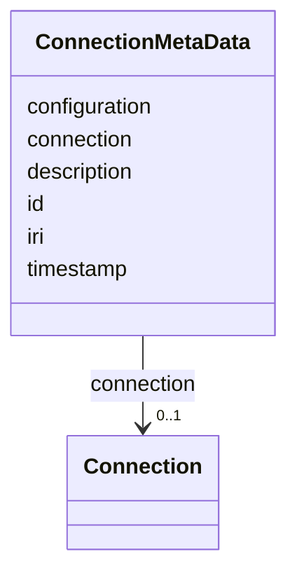

# Class: ConnectionMetaData


_"The Connection Metadata."_


URI: [oso:device/connectionMetaData](http://w3id.org/oso/device/connectionMetaData)





<!-- no inheritance hierarchy -->


## Slots

| Name | Cardinality and Range | Description | Inheritance |
| ---  | --- | --- | --- |
| [id](id.md) | 1 <br/> [String](String.md) | "The identifier of the resource | direct |
| [timestamp](timestamp.md) | 1 <br/> [Datetime](Datetime.md) | "The timestamp of the measurement | direct |
| [description](description.md) | 0..1 <br/> [String](String.md) | "A description of the calculation / measurement | direct |
| [iri](iri.md) | 0..1 <br/> [String](String.md) | "The International Resource Identifier (IRI) of the entity | direct |
| [connection](connection.md) | 0..1 <br/> [Connection](Connection.md) | "The connection descriptor, e | direct |
| [configuration](configuration.md) | 0..1 <br/> [String](String.md) | "Extra / additional configuration of the hardware, in JSON-LD format | direct |


## Identifier and Mapping Information


### Schema Source


* from schema: https://w3id.org/opensourcelab/connection_metadata_model


## Mappings

| Mapping Type | Mapped Value |
| ---  | ---  |
| self | oso:device/connectionMetaData |
| native | oso:ConnectionMetaData |


## LinkML Source

<!-- TODO: investigate https://stackoverflow.com/questions/37606292/how-to-create-tabbed-code-blocks-in-mkdocs-or-sphinx -->

### Direct

<details>
```yaml
name: ConnectionMetaData
description: '"The Connection Metadata."'
from_schema: https://w3id.org/opensourcelab/connection_metadata_model
slots:
- id
- timestamp
- description
- iri
- connection
- configuration
class_uri: oso:device/connectionMetaData

```
</details>

### Induced

<details>
```yaml
name: ConnectionMetaData
description: '"The Connection Metadata."'
from_schema: https://w3id.org/opensourcelab/connection_metadata_model
attributes:
  id:
    name: id
    description: '"The identifier of the resource."'
    from_schema: https://w3id.org/opensourcelab/connection_metadata_model
    rank: 1000
    slot_uri: http://purl.org/dc/terms/identifier
    identifier: true
    alias: id
    owner: ConnectionMetaData
    domain_of:
    - ConnectionMetaData
    - Connection
    range: string
    required: true
  timestamp:
    name: timestamp
    description: '"The timestamp of the measurement."'
    from_schema: https://w3id.org/opensourcelab/connection_metadata_model
    rank: 1000
    slot_uri: http://purl.org/dc/terms/date
    alias: timestamp
    owner: ConnectionMetaData
    domain_of:
    - ConnectionMetaData
    - Connection
    range: datetime
    required: true
  description:
    name: description
    description: '"A description of the calculation / measurement."'
    from_schema: https://w3id.org/opensourcelab/connection_metadata_model
    rank: 1000
    slot_uri: http://purl.org/dc/terms/description
    alias: description
    owner: ConnectionMetaData
    domain_of:
    - ConnectionMetaData
    - Connection
    range: string
    required: false
  iri:
    name: iri
    description: '"The International Resource Identifier (IRI) of the entity."'
    from_schema: https://w3id.org/opensourcelab/connection_metadata_model
    rank: 1000
    slot_uri: oso:entity/IRI
    alias: iri
    owner: ConnectionMetaData
    domain_of:
    - ConnectionMetaData
    range: string
    required: false
  connection:
    name: connection
    description: '"The connection descriptor, e.g., a set of connection parameters,
      like IP, port, bus, etc."'
    from_schema: https://w3id.org/opensourcelab/connection_metadata_model
    rank: 1000
    slot_uri: oso:device/connection
    alias: connection
    owner: ConnectionMetaData
    domain_of:
    - ConnectionMetaData
    range: Connection
    required: false
  configuration:
    name: configuration
    description: '"Extra / additional configuration of the hardware, in JSON-LD format."'
    from_schema: https://w3id.org/opensourcelab/connection_metadata_model
    rank: 1000
    slot_uri: oso:device/configuration
    alias: configuration
    owner: ConnectionMetaData
    domain_of:
    - ConnectionMetaData
    range: string
    required: false
class_uri: oso:device/connectionMetaData

```
</details>