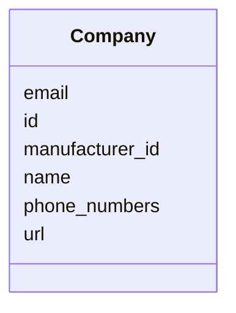

# Class: Company


_"A class representing a Company, e.g., Manufacturer, Service provider."_


URI: [oso:entity/Company](http://w3id.org/oso/entity/Company)





<!-- no inheritance hierarchy -->


## Slots

| Name | Cardinality and Range | Description | Inheritance |
| ---  | --- | --- | --- |
| [id](id.md) | 1 <br/> [String](String.md) | "The identifier of the resource | direct |
| [name](name.md) | 1 <br/> [String](String.md) | "The name of an entity or object | direct |
| [url](url.md) | 0..1 <br/> [String](String.md) | "A Uniform Resource Locator (URL) of, e | direct |
| [email](email.md) | 0..1 <br/> [String](String.md) | "The email address of an entity, person or company | direct |
| [phone_numbers](phone_numbers.md) | * <br/> [String](String.md) | "A list of phone numbers | direct |
| [manufacturer_id](manufacturer_id.md) | 0..1 <br/> [String](String.md) | "Unique ID of a manufacturer (MID) | direct |


## Usages

| used by | used in | type | used |
| ---  | --- | --- | --- |
| [DeviceMetaData](DeviceMetaData.md) | [manufacturers](manufacturers.md) | range | [Company](Company.md) |
| [DeviceMetaData](DeviceMetaData.md) | [service_provider](service_provider.md) | range | [Company](Company.md) |
| [ServiceInfo](ServiceInfo.md) | [service_provider](service_provider.md) | range | [Company](Company.md) |


## Identifier and Mapping Information


### Schema Source


* from schema: https://w3id.org/opensourcelab/device_metadata_model


## Mappings

| Mapping Type | Mapped Value |
| ---  | ---  |
| self | oso:entity/Company |
| native | oso:Company |


## LinkML Source

<!-- TODO: investigate https://stackoverflow.com/questions/37606292/how-to-create-tabbed-code-blocks-in-mkdocs-or-sphinx -->

### Direct

<details>
```yaml
name: Company
description: '"A class representing a Company, e.g., Manufacturer, Service provider."'
from_schema: https://w3id.org/opensourcelab/device_metadata_model
slots:
- id
- name
- url
- email
- phone_numbers
- manufacturer_id
class_uri: oso:entity/Company

```
</details>

### Induced

<details>
```yaml
name: Company
description: '"A class representing a Company, e.g., Manufacturer, Service provider."'
from_schema: https://w3id.org/opensourcelab/device_metadata_model
attributes:
  id:
    name: id
    description: '"The identifier of the resource."'
    from_schema: https://w3id.org/opensourcelab/device_metadata_model
    rank: 1000
    slot_uri: http://purl.org/dc/terms/identifier
    identifier: true
    alias: id
    owner: Company
    domain_of:
    - Company
    - DeviceClass
    - DeviceMetaData
    - ServiceInfo
    range: string
    required: true
  name:
    name: name
    description: '"The name of an entity or object."'
    from_schema: https://w3id.org/opensourcelab/device_metadata_model
    rank: 1000
    slot_uri: oso:entity/Name
    alias: name
    owner: Company
    domain_of:
    - Company
    - DeviceClass
    - ServiceInfo
    range: string
    required: true
  url:
    name: url
    description: '"A Uniform Resource Locator (URL) of, e.g., an entity, person or
      company."'
    from_schema: https://w3id.org/opensourcelab/device_metadata_model
    rank: 1000
    slot_uri: oso:entity/url
    alias: url
    owner: Company
    domain_of:
    - Company
    range: string
    required: false
  email:
    name: email
    description: '"The email address of an entity, person or company."'
    from_schema: https://w3id.org/opensourcelab/device_metadata_model
    rank: 1000
    slot_uri: oso:entity/email
    alias: email
    owner: Company
    domain_of:
    - Person
    - Company
    range: string
    required: false
  phone_numbers:
    name: phone_numbers
    description: '"A list of phone numbers."'
    from_schema: https://w3id.org/opensourcelab/device_metadata_model
    rank: 1000
    slot_uri: oso:entity/phoneNumber
    alias: phone_numbers
    owner: Company
    domain_of:
    - Person
    - Company
    range: string
    required: false
    multivalued: true
  manufacturer_id:
    name: manufacturer_id
    description: '"Unique ID of a manufacturer (MID)."'
    from_schema: https://w3id.org/opensourcelab/device_metadata_model
    rank: 1000
    slot_uri: oso:device/ManufacturerID
    alias: manufacturer_id
    owner: Company
    domain_of:
    - Company
    range: string
    required: false
class_uri: oso:entity/Company

```
</details>