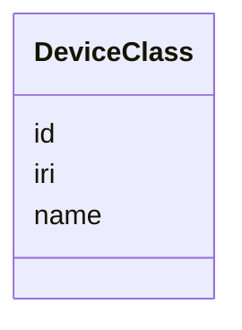

# Class: DeviceClass


_"The Device Class / Type."_


URI: [oso:device/DeviceClass](http://w3id.org/oso/device/DeviceClass)





<!-- no inheritance hierarchy -->


## Slots

| Name | Cardinality and Range | Description | Inheritance |
| ---  | --- | --- | --- |
| [id](id.md) | 1 <br/> [String](String.md) | "The identifier of the resource | direct |
| [name](name.md) | 1 <br/> [String](String.md) | "The name of an entity or object | direct |
| [iri](iri.md) | 0..1 <br/> [String](String.md) | "The International Resource Identifier (IRI) of the entity | direct |


## Identifier and Mapping Information


### Schema Source


* from schema: https://w3id.org/opensourcelab/device_metadata_model


## Mappings

| Mapping Type | Mapped Value |
| ---  | ---  |
| self | oso:device/DeviceClass |
| native | oso:DeviceClass |


## LinkML Source

<!-- TODO: investigate https://stackoverflow.com/questions/37606292/how-to-create-tabbed-code-blocks-in-mkdocs-or-sphinx -->

### Direct

<details>
```yaml
name: DeviceClass
description: '"The Device Class / Type."'
from_schema: https://w3id.org/opensourcelab/device_metadata_model
slots:
- id
- name
- iri
class_uri: oso:device/DeviceClass

```
</details>

### Induced

<details>
```yaml
name: DeviceClass
description: '"The Device Class / Type."'
from_schema: https://w3id.org/opensourcelab/device_metadata_model
attributes:
  id:
    name: id
    description: '"The identifier of the resource."'
    from_schema: https://w3id.org/opensourcelab/device_metadata_model
    rank: 1000
    slot_uri: http://purl.org/dc/terms/identifier
    identifier: true
    alias: id
    owner: DeviceClass
    domain_of:
    - Company
    - DeviceClass
    - DeviceMetaData
    - ServiceInfo
    range: string
    required: true
  name:
    name: name
    description: '"The name of an entity or object."'
    from_schema: https://w3id.org/opensourcelab/device_metadata_model
    rank: 1000
    slot_uri: oso:entity/Name
    alias: name
    owner: DeviceClass
    domain_of:
    - Company
    - DeviceClass
    - ServiceInfo
    range: string
    required: true
  iri:
    name: iri
    description: '"The International Resource Identifier (IRI) of the entity."'
    from_schema: https://w3id.org/opensourcelab/device_metadata_model
    rank: 1000
    slot_uri: oso:entity/IRI
    alias: iri
    owner: DeviceClass
    domain_of:
    - DeviceClass
    - DeviceMetaData
    range: string
    required: false
class_uri: oso:device/DeviceClass

```
</details>