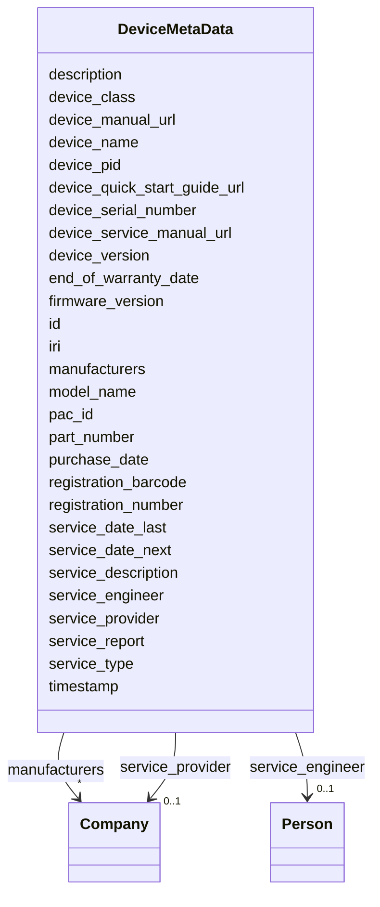

# Class: DeviceMetaData


_"The Device Metadata."_


URI: [oso:device/DeviceMetaData](http://w3id.org/oso/device/DeviceMetaData)





<!-- no inheritance hierarchy -->


## Slots

| Name | Cardinality and Range | Description | Inheritance |
| ---  | --- | --- | --- |
| [id](id.md) | 1 <br/> [String](String.md) | "The identifier of the resource | direct |
| [timestamp](timestamp.md) | 1 <br/> [Datetime](Datetime.md) | "The timestamp of the measurement | direct |
| [description](description.md) | 0..1 <br/> [String](String.md) | "A description of the calculation / measurement | direct |
| [iri](iri.md) | 0..1 <br/> [String](String.md) | "The International Resource Identifier (IRI) of the entity | direct |
| [manufacturers](manufacturers.md) | * <br/> [Company](Company.md) | "Manufacturer of the device | direct |
| [device_class](device_class.md) | 0..1 <br/> [String](String.md) | "The Class / Type of the device | direct |
| [device_name](device_name.md) | 0..1 <br/> [String](String.md) | "The full name of the device | direct |
| [model_name](model_name.md) | 0..1 <br/> [String](String.md) | "The model name of the device | direct |
| [device_version](device_version.md) | 0..1 <br/> [String](String.md) | "The version of the device | direct |
| [device_serial_number](device_serial_number.md) | 0..1 <br/> [String](String.md) | "The serial number of the device | direct |
| [part_number](part_number.md) | 0..1 <br/> [String](String.md) | "The part number | direct |
| [device_pid](device_pid.md) | 0..1 <br/> [String](String.md) | "The persistent and unique identifier (PID) of the device | direct |
| [pac_id](pac_id.md) | 0..1 <br/> [String](String.md) | "The Publicly Addressable Content IDentifier (PAC-ID) is a unique identifier ... | direct |
| [firmware_version](firmware_version.md) | 1 <br/> [String](String.md) | "The version of the firmware of the device | direct |
| [device_manual_url](device_manual_url.md) | 0..1 <br/> [String](String.md) | "An URL to the manual of the device | direct |
| [device_quick_start_guide_url](device_quick_start_guide_url.md) | 0..1 <br/> [String](String.md) | "An URL to the quick start guide of the device | direct |
| [device_service_manual_url](device_service_manual_url.md) | 0..1 <br/> [String](String.md) | "An URL to the service manual of the device | direct |
| [registration_number](registration_number.md) | 0..1 <br/> [String](String.md) | "The registration number of the device, e | direct |
| [registration_barcode](registration_barcode.md) | 0..1 <br/> [String](String.md) | "The registration barcode of the device | direct |
| [purchase_date](purchase_date.md) | 0..1 <br/> [Datetime](Datetime.md) | "The date of purchase of the device | direct |
| [end_of_warranty_date](end_of_warranty_date.md) | 0..1 <br/> [Datetime](Datetime.md) | "The end of warranty date of the device | direct |
| [service_date_last](service_date_last.md) | 0..1 <br/> [Datetime](Datetime.md) | "The date of the last service | direct |
| [service_date_next](service_date_next.md) | 0..1 <br/> [Datetime](Datetime.md) | "The date of the next service | direct |
| [service_type](service_type.md) | 0..1 <br/> [String](String.md) | "The type of service, e | direct |
| [service_description](service_description.md) | 0..1 <br/> [String](String.md) | "A description of the service | direct |
| [service_report](service_report.md) | 0..1 <br/> [String](String.md) | "An URL to the service report | direct |
| [service_provider](service_provider.md) | 0..1 <br/> [Company](Company.md) | "The service provider, e | direct |
| [service_engineer](service_engineer.md) | 0..1 <br/> [Person](Person.md) | "The service engineer | direct |


## Identifier and Mapping Information


### Schema Source


* from schema: https://w3id.org/opensourcelab/device_metadata_model


## Mappings

| Mapping Type | Mapped Value |
| ---  | ---  |
| self | oso:device/DeviceMetaData |
| native | oso:DeviceMetaData |


## LinkML Source

<!-- TODO: investigate https://stackoverflow.com/questions/37606292/how-to-create-tabbed-code-blocks-in-mkdocs-or-sphinx -->

### Direct

<details>
```yaml
name: DeviceMetaData
description: '"The Device Metadata."'
from_schema: https://w3id.org/opensourcelab/device_metadata_model
slots:
- id
- timestamp
- description
- iri
- manufacturers
- device_class
- device_name
- model_name
- device_version
- device_serial_number
- part_number
- device_pid
- pac_id
- firmware_version
- device_manual_url
- device_quick_start_guide_url
- device_service_manual_url
- registration_number
- registration_barcode
- purchase_date
- end_of_warranty_date
- service_date_last
- service_date_next
- service_type
- service_description
- service_report
- service_provider
- service_engineer
class_uri: oso:device/DeviceMetaData

```
</details>

### Induced

<details>
```yaml
name: DeviceMetaData
description: '"The Device Metadata."'
from_schema: https://w3id.org/opensourcelab/device_metadata_model
attributes:
  id:
    name: id
    description: '"The identifier of the resource."'
    from_schema: https://w3id.org/opensourcelab/device_metadata_model
    rank: 1000
    slot_uri: http://purl.org/dc/terms/identifier
    identifier: true
    alias: id
    owner: DeviceMetaData
    domain_of:
    - Company
    - DeviceClass
    - DeviceMetaData
    - ServiceInfo
    range: string
    required: true
  timestamp:
    name: timestamp
    description: '"The timestamp of the measurement."'
    from_schema: https://w3id.org/opensourcelab/device_metadata_model
    rank: 1000
    slot_uri: http://purl.org/dc/terms/date
    alias: timestamp
    owner: DeviceMetaData
    domain_of:
    - DeviceMetaData
    - ServiceInfo
    range: datetime
    required: true
  description:
    name: description
    description: '"A description of the calculation / measurement."'
    from_schema: https://w3id.org/opensourcelab/device_metadata_model
    rank: 1000
    slot_uri: http://purl.org/dc/terms/description
    alias: description
    owner: DeviceMetaData
    domain_of:
    - DeviceMetaData
    range: string
    required: false
  iri:
    name: iri
    description: '"The International Resource Identifier (IRI) of the entity."'
    from_schema: https://w3id.org/opensourcelab/device_metadata_model
    rank: 1000
    slot_uri: oso:entity/IRI
    alias: iri
    owner: DeviceMetaData
    domain_of:
    - DeviceClass
    - DeviceMetaData
    range: string
    required: false
  manufacturers:
    name: manufacturers
    description: '"Manufacturer of the device."'
    from_schema: https://w3id.org/opensourcelab/device_metadata_model
    rank: 1000
    slot_uri: oso:device/Manufacturer
    alias: manufacturers
    owner: DeviceMetaData
    domain_of:
    - DeviceMetaData
    range: Company
    required: false
    multivalued: true
  device_class:
    name: device_class
    description: '"The Class / Type of the device. E.g. Gas Chromatograph, NMR. Thermometer,
      UV-spectrometer, MALDI-TOF-MS, HPLC, etc."'
    from_schema: https://w3id.org/opensourcelab/device_metadata_model
    rank: 1000
    slot_uri: oso:measurement/deviceClass
    alias: device_class
    owner: DeviceMetaData
    domain_of:
    - DeviceMetaData
    range: string
    required: false
  device_name:
    name: device_name
    description: '"The full name of the device."'
    from_schema: https://w3id.org/opensourcelab/device_metadata_model
    rank: 1000
    slot_uri: oso:measurement/deviceName
    alias: device_name
    owner: DeviceMetaData
    domain_of:
    - DeviceMetaData
    range: string
    required: false
  model_name:
    name: model_name
    description: '"The model name of the device."'
    from_schema: https://w3id.org/opensourcelab/device_metadata_model
    rank: 1000
    slot_uri: oso:measurement/deviceModel
    alias: model_name
    owner: DeviceMetaData
    domain_of:
    - DeviceMetaData
    range: string
    required: false
  device_version:
    name: device_version
    description: '"The version of the device."'
    from_schema: https://w3id.org/opensourcelab/device_metadata_model
    rank: 1000
    slot_uri: oso:/device/version
    alias: device_version
    owner: DeviceMetaData
    domain_of:
    - DeviceMetaData
    range: string
    required: false
  device_serial_number:
    name: device_serial_number
    description: '"The serial number of the device."'
    from_schema: https://w3id.org/opensourcelab/device_metadata_model
    rank: 1000
    slot_uri: oso:device/serialNumber
    alias: device_serial_number
    owner: DeviceMetaData
    domain_of:
    - DeviceMetaData
    range: string
    required: false
  part_number:
    name: part_number
    description: '"The part number."'
    from_schema: https://w3id.org/opensourcelab/device_metadata_model
    rank: 1000
    slot_uri: oso:device/partNumber
    alias: part_number
    owner: DeviceMetaData
    domain_of:
    - DeviceMetaData
    range: string
    required: false
  device_pid:
    name: device_pid
    description: '"The persistent and unique identifier (PID) of the device."'
    from_schema: https://w3id.org/opensourcelab/device_metadata_model
    rank: 1000
    slot_uri: oso:/device/PID
    alias: device_pid
    owner: DeviceMetaData
    domain_of:
    - DeviceMetaData
    range: string
    required: false
  pac_id:
    name: pac_id
    description: '"The Publicly Addressable Content IDentifier (PAC-ID) is a unique
      identifier (s. https://github.com/ApiniLabs/PAC-ID) ."'
    from_schema: https://w3id.org/opensourcelab/device_metadata_model
    rank: 1000
    slot_uri: oso:device/pacID
    alias: pac_id
    owner: DeviceMetaData
    domain_of:
    - DeviceMetaData
    range: string
    required: false
  firmware_version:
    name: firmware_version
    description: '"The version of the firmware of the device."'
    from_schema: https://w3id.org/opensourcelab/device_metadata_model
    rank: 1000
    slot_uri: oso:device/deviceFirmwareVersion
    alias: firmware_version
    owner: DeviceMetaData
    domain_of:
    - DeviceMetaData
    range: string
    required: true
  device_manual_url:
    name: device_manual_url
    description: '"An URL to the manual of the device."'
    from_schema: https://w3id.org/opensourcelab/device_metadata_model
    rank: 1000
    slot_uri: oso:device/deviceManual
    alias: device_manual_url
    owner: DeviceMetaData
    domain_of:
    - DeviceMetaData
    range: string
    required: false
  device_quick_start_guide_url:
    name: device_quick_start_guide_url
    description: '"An URL to the quick start guide of the device."'
    from_schema: https://w3id.org/opensourcelab/device_metadata_model
    rank: 1000
    slot_uri: oso:device/deviceQuickStartGuide
    alias: device_quick_start_guide_url
    owner: DeviceMetaData
    domain_of:
    - DeviceMetaData
    range: string
    required: false
  device_service_manual_url:
    name: device_service_manual_url
    description: '"An URL to the service manual of the device."'
    from_schema: https://w3id.org/opensourcelab/device_metadata_model
    rank: 1000
    slot_uri: oso:device/deviceServiceManual
    alias: device_service_manual_url
    owner: DeviceMetaData
    domain_of:
    - DeviceMetaData
    range: string
    required: false
  registration_number:
    name: registration_number
    description: '"The registration number of the device, e.g. inventory number."'
    from_schema: https://w3id.org/opensourcelab/device_metadata_model
    rank: 1000
    slot_uri: oso:device/deviceRegistrationNumber
    alias: registration_number
    owner: DeviceMetaData
    domain_of:
    - DeviceMetaData
    range: string
    required: false
  registration_barcode:
    name: registration_barcode
    description: '"The registration barcode of the device."'
    from_schema: https://w3id.org/opensourcelab/device_metadata_model
    rank: 1000
    slot_uri: oso:device/deviceRegistrationBarcode
    alias: registration_barcode
    owner: DeviceMetaData
    domain_of:
    - DeviceMetaData
    range: string
    required: false
  purchase_date:
    name: purchase_date
    description: '"The date of purchase of the device."'
    from_schema: https://w3id.org/opensourcelab/device_metadata_model
    rank: 1000
    slot_uri: oso:device/devicePurchaseDate
    alias: purchase_date
    owner: DeviceMetaData
    domain_of:
    - DeviceMetaData
    range: datetime
    required: false
  end_of_warranty_date:
    name: end_of_warranty_date
    description: '"The end of warranty date of the device."'
    from_schema: https://w3id.org/opensourcelab/device_metadata_model
    rank: 1000
    slot_uri: oso:device/deviceEndOfWarrantyDate
    alias: end_of_warranty_date
    owner: DeviceMetaData
    domain_of:
    - DeviceMetaData
    range: datetime
    required: false
  service_date_last:
    name: service_date_last
    description: '"The date of the last service."'
    from_schema: https://w3id.org/opensourcelab/device_metadata_model
    rank: 1000
    slot_uri: oso:device/deviceServiceDateLast
    alias: service_date_last
    owner: DeviceMetaData
    domain_of:
    - DeviceMetaData
    - ServiceInfo
    range: datetime
    required: false
  service_date_next:
    name: service_date_next
    description: '"The date of the next service."'
    from_schema: https://w3id.org/opensourcelab/device_metadata_model
    rank: 1000
    slot_uri: oso:device/deviceServiceDateNext
    alias: service_date_next
    owner: DeviceMetaData
    domain_of:
    - DeviceMetaData
    - ServiceInfo
    range: datetime
    required: false
  service_type:
    name: service_type
    description: '"The type of service, e.g., calibration, maintenance, repair."'
    from_schema: https://w3id.org/opensourcelab/device_metadata_model
    rank: 1000
    slot_uri: oso:device/deviceServiceType
    alias: service_type
    owner: DeviceMetaData
    domain_of:
    - DeviceMetaData
    - ServiceInfo
    range: string
    required: false
  service_description:
    name: service_description
    description: '"A description of the service."'
    from_schema: https://w3id.org/opensourcelab/device_metadata_model
    rank: 1000
    slot_uri: oso:device/deviceServiceDescription
    alias: service_description
    owner: DeviceMetaData
    domain_of:
    - DeviceMetaData
    - ServiceInfo
    range: string
    required: false
  service_report:
    name: service_report
    description: '"An URL to the service report."'
    from_schema: https://w3id.org/opensourcelab/device_metadata_model
    rank: 1000
    slot_uri: oso:device/deviceServiceReport
    alias: service_report
    owner: DeviceMetaData
    domain_of:
    - DeviceMetaData
    - ServiceInfo
    range: string
    required: false
  service_provider:
    name: service_provider
    description: '"The service provider, e.g. a company."'
    from_schema: https://w3id.org/opensourcelab/device_metadata_model
    rank: 1000
    slot_uri: oso:device/deviceServiceProvider
    alias: service_provider
    owner: DeviceMetaData
    domain_of:
    - DeviceMetaData
    - ServiceInfo
    range: Company
    required: false
  service_engineer:
    name: service_engineer
    description: '"The service engineer."'
    from_schema: https://w3id.org/opensourcelab/device_metadata_model
    rank: 1000
    slot_uri: oso:device/deviceServiceEngineer
    alias: service_engineer
    owner: DeviceMetaData
    domain_of:
    - DeviceMetaData
    - ServiceInfo
    range: Person
    required: false
class_uri: oso:device/DeviceMetaData

```
</details>