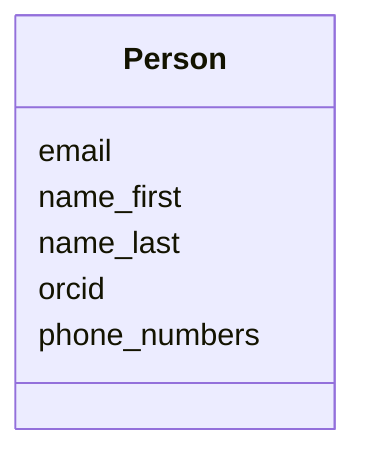

# Class: Person


_"The User class represents a user of the SciDatS system."_


URI: [oso:entity](http://w3id.org/oso/entity)





<!-- no inheritance hierarchy -->


## Slots

| Name | Cardinality and Range | Description | Inheritance |
| ---  | --- | --- | --- |
| [name_last](name_last.md) | 1 <br/> [String](String.md) | "The last name of the user | direct |
| [name_first](name_first.md) | 1 <br/> [String](String.md) | "The first name of the user | direct |
| [email](email.md) | 0..1 <br/> [String](String.md) | "The email address of an entity, person or company | direct |
| [phone_numbers](phone_numbers.md) | * <br/> [String](String.md) | "A list of phone numbers | direct |
| [orcid](orcid.md) | 1 <br/> [String](String.md) | "The Open Researcher and Contributor ID [ORCID](https://orcid | direct |


## Usages

| used by | used in | type | used |
| ---  | --- | --- | --- |
| [DeviceMetaData](DeviceMetaData.md) | [service_engineer](service_engineer.md) | range | [Person](Person.md) |
| [ServiceInfo](ServiceInfo.md) | [service_engineer](service_engineer.md) | range | [Person](Person.md) |


## Identifier and Mapping Information


### Schema Source


* from schema: https://w3id.org/opensourcelab/device_metadata_model


## Mappings

| Mapping Type | Mapped Value |
| ---  | ---  |
| self | oso:entity |
| native | oso:Person |


## LinkML Source

<!-- TODO: investigate https://stackoverflow.com/questions/37606292/how-to-create-tabbed-code-blocks-in-mkdocs-or-sphinx -->

### Direct

<details>
```yaml
name: Person
description: '"The User class represents a user of the SciDatS system."'
from_schema: https://w3id.org/opensourcelab/device_metadata_model
slots:
- name_last
- name_first
- email
- phone_numbers
- orcid
class_uri: oso:entity

```
</details>

### Induced

<details>
```yaml
name: Person
description: '"The User class represents a user of the SciDatS system."'
from_schema: https://w3id.org/opensourcelab/device_metadata_model
attributes:
  name_last:
    name: name_last
    description: '"The last name of the user."'
    from_schema: https://w3id.org/opensourcelab/device_metadata_model
    rank: 1000
    slot_uri: oso:entity/lastName
    alias: name_last
    owner: Person
    domain_of:
    - Person
    range: string
    required: true
  name_first:
    name: name_first
    description: '"The first name of the user."'
    from_schema: https://w3id.org/opensourcelab/device_metadata_model
    rank: 1000
    slot_uri: oso:entity/firstName
    alias: name_first
    owner: Person
    domain_of:
    - Person
    range: string
    required: true
  email:
    name: email
    description: '"The email address of an entity, person or company."'
    from_schema: https://w3id.org/opensourcelab/device_metadata_model
    rank: 1000
    slot_uri: oso:entity/email
    alias: email
    owner: Person
    domain_of:
    - Person
    - Company
    range: string
    required: false
  phone_numbers:
    name: phone_numbers
    description: '"A list of phone numbers."'
    from_schema: https://w3id.org/opensourcelab/device_metadata_model
    rank: 1000
    slot_uri: oso:entity/phoneNumber
    alias: phone_numbers
    owner: Person
    domain_of:
    - Person
    - Company
    range: string
    required: false
    multivalued: true
  orcid:
    name: orcid
    description: '"The Open Researcher and Contributor ID [ORCID](https://orcid.org/)
      of a researcher."'
    from_schema: https://w3id.org/opensourcelab/device_metadata_model
    rank: 1000
    slot_uri: oso:entity/ORCID
    alias: orcid
    owner: Person
    domain_of:
    - Person
    range: string
    required: true
class_uri: oso:entity

```
</details>