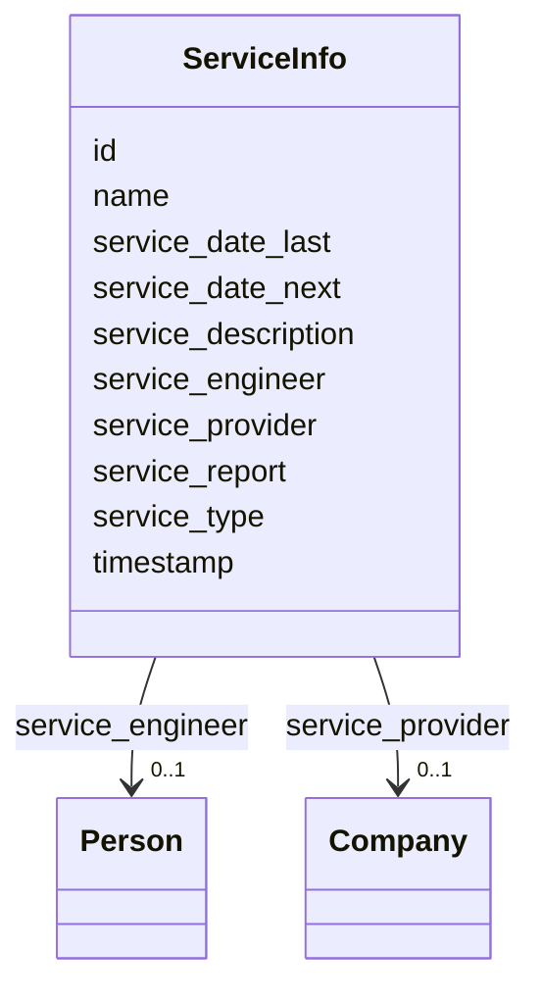

# Class: ServiceInfo


_"The Service Info."_


URI: [oso:device/ServiceInfo](http://w3id.org/oso/device/ServiceInfo)





<!-- no inheritance hierarchy -->


## Slots

| Name | Cardinality and Range | Description | Inheritance |
| ---  | --- | --- | --- |
| [id](id.md) | 1 <br/> [String](String.md) | "The identifier of the resource | direct |
| [timestamp](timestamp.md) | 1 <br/> [Datetime](Datetime.md) | "The timestamp of the measurement | direct |
| [name](name.md) | 1 <br/> [String](String.md) | "The name of an entity or object | direct |
| [service_description](service_description.md) | 0..1 <br/> [String](String.md) | "A description of the service | direct |
| [service_type](service_type.md) | 0..1 <br/> [String](String.md) | "The type of service, e | direct |
| [service_date_last](service_date_last.md) | 0..1 <br/> [Datetime](Datetime.md) | "The date of the last service | direct |
| [service_date_next](service_date_next.md) | 0..1 <br/> [Datetime](Datetime.md) | "The date of the next service | direct |
| [service_report](service_report.md) | 0..1 <br/> [String](String.md) | "An URL to the service report | direct |
| [service_provider](service_provider.md) | 0..1 <br/> [Company](Company.md) | "The service provider, e | direct |
| [service_engineer](service_engineer.md) | 0..1 <br/> [Person](Person.md) | "The service engineer | direct |


## Identifier and Mapping Information


### Schema Source


* from schema: https://w3id.org/opensourcelab/device_metadata_model


## Mappings

| Mapping Type | Mapped Value |
| ---  | ---  |
| self | oso:device/ServiceInfo |
| native | oso:ServiceInfo |


## LinkML Source

<!-- TODO: investigate https://stackoverflow.com/questions/37606292/how-to-create-tabbed-code-blocks-in-mkdocs-or-sphinx -->

### Direct

<details>
```yaml
name: ServiceInfo
description: '"The Service Info."'
from_schema: https://w3id.org/opensourcelab/device_metadata_model
slots:
- id
- timestamp
- name
- service_description
- service_type
- service_date_last
- service_date_next
- service_report
- service_provider
- service_engineer
class_uri: oso:device/ServiceInfo

```
</details>

### Induced

<details>
```yaml
name: ServiceInfo
description: '"The Service Info."'
from_schema: https://w3id.org/opensourcelab/device_metadata_model
attributes:
  id:
    name: id
    description: '"The identifier of the resource."'
    from_schema: https://w3id.org/opensourcelab/device_metadata_model
    rank: 1000
    slot_uri: http://purl.org/dc/terms/identifier
    identifier: true
    alias: id
    owner: ServiceInfo
    domain_of:
    - Company
    - DeviceClass
    - DeviceMetaData
    - ServiceInfo
    range: string
    required: true
  timestamp:
    name: timestamp
    description: '"The timestamp of the measurement."'
    from_schema: https://w3id.org/opensourcelab/device_metadata_model
    rank: 1000
    slot_uri: http://purl.org/dc/terms/date
    alias: timestamp
    owner: ServiceInfo
    domain_of:
    - DeviceMetaData
    - ServiceInfo
    range: datetime
    required: true
  name:
    name: name
    description: '"The name of an entity or object."'
    from_schema: https://w3id.org/opensourcelab/device_metadata_model
    rank: 1000
    slot_uri: oso:entity/Name
    alias: name
    owner: ServiceInfo
    domain_of:
    - Company
    - DeviceClass
    - ServiceInfo
    range: string
    required: true
  service_description:
    name: service_description
    description: '"A description of the service."'
    from_schema: https://w3id.org/opensourcelab/device_metadata_model
    rank: 1000
    slot_uri: oso:device/deviceServiceDescription
    alias: service_description
    owner: ServiceInfo
    domain_of:
    - DeviceMetaData
    - ServiceInfo
    range: string
    required: false
  service_type:
    name: service_type
    description: '"The type of service, e.g., calibration, maintenance, repair."'
    from_schema: https://w3id.org/opensourcelab/device_metadata_model
    rank: 1000
    slot_uri: oso:device/deviceServiceType
    alias: service_type
    owner: ServiceInfo
    domain_of:
    - DeviceMetaData
    - ServiceInfo
    range: string
    required: false
  service_date_last:
    name: service_date_last
    description: '"The date of the last service."'
    from_schema: https://w3id.org/opensourcelab/device_metadata_model
    rank: 1000
    slot_uri: oso:device/deviceServiceDateLast
    alias: service_date_last
    owner: ServiceInfo
    domain_of:
    - DeviceMetaData
    - ServiceInfo
    range: datetime
    required: false
  service_date_next:
    name: service_date_next
    description: '"The date of the next service."'
    from_schema: https://w3id.org/opensourcelab/device_metadata_model
    rank: 1000
    slot_uri: oso:device/deviceServiceDateNext
    alias: service_date_next
    owner: ServiceInfo
    domain_of:
    - DeviceMetaData
    - ServiceInfo
    range: datetime
    required: false
  service_report:
    name: service_report
    description: '"An URL to the service report."'
    from_schema: https://w3id.org/opensourcelab/device_metadata_model
    rank: 1000
    slot_uri: oso:device/deviceServiceReport
    alias: service_report
    owner: ServiceInfo
    domain_of:
    - DeviceMetaData
    - ServiceInfo
    range: string
    required: false
  service_provider:
    name: service_provider
    description: '"The service provider, e.g. a company."'
    from_schema: https://w3id.org/opensourcelab/device_metadata_model
    rank: 1000
    slot_uri: oso:device/deviceServiceProvider
    alias: service_provider
    owner: ServiceInfo
    domain_of:
    - DeviceMetaData
    - ServiceInfo
    range: Company
    required: false
  service_engineer:
    name: service_engineer
    description: '"The service engineer."'
    from_schema: https://w3id.org/opensourcelab/device_metadata_model
    rank: 1000
    slot_uri: oso:device/deviceServiceEngineer
    alias: service_engineer
    owner: ServiceInfo
    domain_of:
    - DeviceMetaData
    - ServiceInfo
    range: Person
    required: false
class_uri: oso:device/ServiceInfo

```
</details>