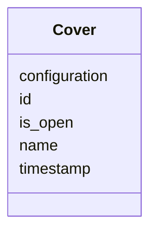

# Class: Cover


_"The Cover or door of a device."_


URI: [oso:device/Cover](http://w3id.org/oso/device/Cover)





<!-- no inheritance hierarchy -->


## Slots

| Name | Cardinality and Range | Description | Inheritance |
| ---  | --- | --- | --- |
| [id](id.md) | 1 <br/> [String](String.md) | "The identifier of the resource | direct |
| [timestamp](timestamp.md) | 1 <br/> [Datetime](Datetime.md) | "The timestamp of the measurement | direct |
| [name](name.md) | 1 <br/> [String](String.md) | "The name of an entity or object | direct |
| [is_open](is_open.md) | 0..1 <br/> [Boolean](Boolean.md) | "True if the cover / door is open | direct |
| [configuration](configuration.md) | 0..1 <br/> [String](String.md) | "Extra / additional configuration of the hardware, in JSON-LD format | direct |


## Usages

| used by | used in | type | used |
| ---  | --- | --- | --- |
| [StorageMetaData](StorageMetaData.md) | [covers](covers.md) | range | [Cover](Cover.md) |


## Identifier and Mapping Information


### Schema Source


* from schema: https://w3id.org/opensourcelab/storage_metadata_model


## Mappings

| Mapping Type | Mapped Value |
| ---  | ---  |
| self | oso:device/Cover |
| native | oso:Cover |


## LinkML Source

<!-- TODO: investigate https://stackoverflow.com/questions/37606292/how-to-create-tabbed-code-blocks-in-mkdocs-or-sphinx -->

### Direct

<details>
```yaml
name: Cover
description: '"The Cover or door of a device."'
from_schema: https://w3id.org/opensourcelab/storage_metadata_model
slots:
- id
- timestamp
- name
- is_open
- configuration
class_uri: oso:device/Cover

```
</details>

### Induced

<details>
```yaml
name: Cover
description: '"The Cover or door of a device."'
from_schema: https://w3id.org/opensourcelab/storage_metadata_model
attributes:
  id:
    name: id
    description: '"The identifier of the resource."'
    from_schema: https://w3id.org/opensourcelab/storage_metadata_model
    rank: 1000
    slot_uri: http://purl.org/dc/terms/identifier
    identifier: true
    alias: id
    owner: Cover
    domain_of:
    - StorageMetaData
    - LabwarePosition
    - LabwareTransfer
    - Cover
    - LabwareMover
    - Rack
    range: string
    required: true
  timestamp:
    name: timestamp
    description: '"The timestamp of the measurement."'
    from_schema: https://w3id.org/opensourcelab/storage_metadata_model
    rank: 1000
    slot_uri: http://purl.org/dc/terms/date
    alias: timestamp
    owner: Cover
    domain_of:
    - StorageMetaData
    - LabwarePosition
    - LabwareTransfer
    - Cover
    - LabwareMover
    - Rack
    range: datetime
    required: true
  name:
    name: name
    description: '"The name of an entity or object."'
    from_schema: https://w3id.org/opensourcelab/storage_metadata_model
    rank: 1000
    slot_uri: oso:entity/Name
    alias: name
    owner: Cover
    domain_of:
    - LabwarePosition
    - LabwareTransfer
    - Cover
    range: string
    required: true
  is_open:
    name: is_open
    description: '"True if the cover / door is open."'
    from_schema: https://w3id.org/opensourcelab/storage_metadata_model
    rank: 1000
    slot_uri: oso:device/isOpen
    alias: is_open
    owner: Cover
    domain_of:
    - Cover
    range: boolean
    required: false
  configuration:
    name: configuration
    description: '"Extra / additional configuration of the hardware, in JSON-LD format."'
    from_schema: https://w3id.org/opensourcelab/storage_metadata_model
    rank: 1000
    slot_uri: oso:device/configuration
    alias: configuration
    owner: Cover
    domain_of:
    - StorageMetaData
    - LabwarePosition
    - LabwareTransfer
    - Cover
    - LabwareMover
    - Rack
    range: string
    required: false
class_uri: oso:device/Cover

```
</details>