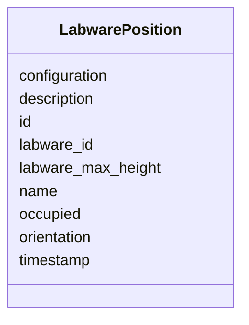

# Class: LabwarePosition


_"The Labware Position / location / Nest in a Rack."_


URI: [oso:device/Position](http://w3id.org/oso/device/Position)





<!-- no inheritance hierarchy -->


## Slots

| Name | Cardinality and Range | Description | Inheritance |
| ---  | --- | --- | --- |
| [id](id.md) | 1 <br/> [String](String.md) | "The identifier of the resource | direct |
| [timestamp](timestamp.md) | 1 <br/> [Datetime](Datetime.md) | "The timestamp of the measurement | direct |
| [name](name.md) | 1 <br/> [String](String.md) | "The name of an entity or object | direct |
| [description](description.md) | 0..1 <br/> [String](String.md) | "A description of the calculation / measurement | direct |
| [labware_id](labware_id.md) | 0..1 <br/> [String](String.md) | "A unique identifier of the labware | direct |
| [labware_max_height](labware_max_height.md) | 0..1 <br/> [Float](Float.md) | max | direct |
| [orientation](orientation.md) | 0..1 <br/> [String](String.md) | "The orientation of the labware in a position, e | direct |
| [occupied](occupied.md) | 0..1 <br/> [Boolean](Boolean.md) | "True if the position is occupied | direct |
| [configuration](configuration.md) | 0..1 <br/> [String](String.md) | "Extra / additional configuration of the hardware, in JSON-LD format | direct |


## Usages

| used by | used in | type | used |
| ---  | --- | --- | --- |
| [Rack](Rack.md) | [labware_positions](labware_positions.md) | range | [LabwarePosition](LabwarePosition.md) |


## Identifier and Mapping Information


### Schema Source


* from schema: https://w3id.org/opensourcelab/storage_metadata_model


## Mappings

| Mapping Type | Mapped Value |
| ---  | ---  |
| self | oso:device/Position |
| native | oso:LabwarePosition |


## LinkML Source

<!-- TODO: investigate https://stackoverflow.com/questions/37606292/how-to-create-tabbed-code-blocks-in-mkdocs-or-sphinx -->

### Direct

<details>
```yaml
name: LabwarePosition
description: '"The Labware Position / location / Nest in a Rack."'
from_schema: https://w3id.org/opensourcelab/storage_metadata_model
slots:
- id
- timestamp
- name
- description
- labware_id
- labware_max_height
- orientation
- occupied
- configuration
class_uri: oso:device/Position

```
</details>

### Induced

<details>
```yaml
name: LabwarePosition
description: '"The Labware Position / location / Nest in a Rack."'
from_schema: https://w3id.org/opensourcelab/storage_metadata_model
attributes:
  id:
    name: id
    description: '"The identifier of the resource."'
    from_schema: https://w3id.org/opensourcelab/storage_metadata_model
    rank: 1000
    slot_uri: http://purl.org/dc/terms/identifier
    identifier: true
    alias: id
    owner: LabwarePosition
    domain_of:
    - StorageMetaData
    - LabwarePosition
    - LabwareTransfer
    - Cover
    - LabwareMover
    - Rack
    range: string
    required: true
  timestamp:
    name: timestamp
    description: '"The timestamp of the measurement."'
    from_schema: https://w3id.org/opensourcelab/storage_metadata_model
    rank: 1000
    slot_uri: http://purl.org/dc/terms/date
    alias: timestamp
    owner: LabwarePosition
    domain_of:
    - StorageMetaData
    - LabwarePosition
    - LabwareTransfer
    - Cover
    - LabwareMover
    - Rack
    range: datetime
    required: true
  name:
    name: name
    description: '"The name of an entity or object."'
    from_schema: https://w3id.org/opensourcelab/storage_metadata_model
    rank: 1000
    slot_uri: oso:entity/Name
    alias: name
    owner: LabwarePosition
    domain_of:
    - LabwarePosition
    - LabwareTransfer
    - Cover
    range: string
    required: true
  description:
    name: description
    description: '"A description of the calculation / measurement."'
    from_schema: https://w3id.org/opensourcelab/storage_metadata_model
    rank: 1000
    slot_uri: http://purl.org/dc/terms/description
    alias: description
    owner: LabwarePosition
    domain_of:
    - StorageMetaData
    - LabwarePosition
    - LabwareTransfer
    - LabwareMover
    - Rack
    range: string
    required: false
  labware_id:
    name: labware_id
    description: '"A unique identifier of the labware."'
    from_schema: https://w3id.org/opensourcelab/storage_metadata_model
    rank: 1000
    slot_uri: oso:device/labwareID
    alias: labware_id
    owner: LabwarePosition
    domain_of:
    - LabwarePosition
    - LabwareTransfer
    - LabwareMover
    range: string
    required: false
  labware_max_height:
    name: labware_max_height
    description: max. labware height in m
    from_schema: https://w3id.org/opensourcelab/storage_metadata_model
    rank: 1000
    slot_uri: oso:device/labware_max_height
    alias: labware_max_height
    owner: LabwarePosition
    domain_of:
    - StorageMetaData
    - LabwarePosition
    - Rack
    range: float
    required: false
  orientation:
    name: orientation
    description: '"The orientation of the labware in a position, e.g. landscape /
      portrait."'
    from_schema: https://w3id.org/opensourcelab/storage_metadata_model
    rank: 1000
    slot_uri: oso:device/orientation
    alias: orientation
    owner: LabwarePosition
    domain_of:
    - LabwarePosition
    range: string
    required: false
  occupied:
    name: occupied
    description: '"True if the position is occupied."'
    from_schema: https://w3id.org/opensourcelab/storage_metadata_model
    rank: 1000
    slot_uri: oso:device/occupied
    alias: occupied
    owner: LabwarePosition
    domain_of:
    - LabwarePosition
    - LabwareTransfer
    - LabwareMover
    range: boolean
    required: false
  configuration:
    name: configuration
    description: '"Extra / additional configuration of the hardware, in JSON-LD format."'
    from_schema: https://w3id.org/opensourcelab/storage_metadata_model
    rank: 1000
    slot_uri: oso:device/configuration
    alias: configuration
    owner: LabwarePosition
    domain_of:
    - StorageMetaData
    - LabwarePosition
    - LabwareTransfer
    - Cover
    - LabwareMover
    - Rack
    range: string
    required: false
class_uri: oso:device/Position

```
</details>