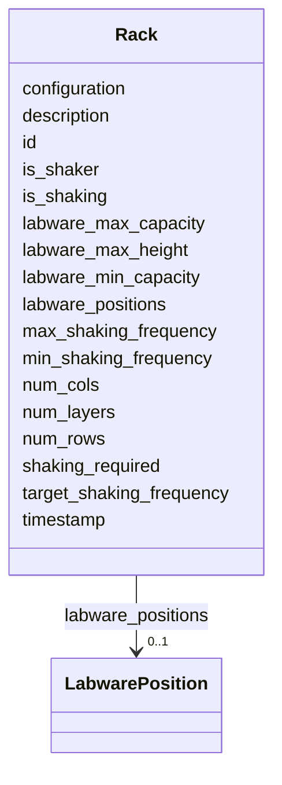

# Class: Rack


_"The Rack / Stack - a vertically and/or horizontally arrangement of labware positions."_


URI: [oso:device/Rack](http://w3id.org/oso/device/Rack)





<!-- no inheritance hierarchy -->


## Slots

| Name | Cardinality and Range | Description | Inheritance |
| ---  | --- | --- | --- |
| [id](id.md) | 1 <br/> [String](String.md) | "The identifier of the resource | direct |
| [timestamp](timestamp.md) | 1 <br/> [Datetime](Datetime.md) | "The timestamp of the measurement | direct |
| [description](description.md) | 0..1 <br/> [String](String.md) | "A description of the calculation / measurement | direct |
| [labware_positions](labware_positions.md) | 0..1 <br/> [LabwarePosition](LabwarePosition.md) | "The labware positions / locations / nests in the rack | direct |
| [num_cols](num_cols.md) | 0..1 <br/> [Integer](Integer.md) | "The number of columns in the rack | direct |
| [num_rows](num_rows.md) | 0..1 <br/> [Integer](Integer.md) | "The number of rows in the rack | direct |
| [num_layers](num_layers.md) | 0..1 <br/> [Integer](Integer.md) | "The number of layers in the rack | direct |
| [labware_min_capacity](labware_min_capacity.md) | 0..1 <br/> [Integer](Integer.md) | labware capacity, min | direct |
| [labware_max_capacity](labware_max_capacity.md) | 0..1 <br/> [Integer](Integer.md) | labware capacity, max | direct |
| [labware_max_height](labware_max_height.md) | 0..1 <br/> [Float](Float.md) | max | direct |
| [is_shaker](is_shaker.md) | 0..1 <br/> [Boolean](Boolean.md) | "True if the rack is a shaker | direct |
| [min_shaking_frequency](min_shaking_frequency.md) | 0..1 <br/> [Float](Float.md) | "The minimum shaking frequency | direct |
| [max_shaking_frequency](max_shaking_frequency.md) | 0..1 <br/> [Float](Float.md) | "The maximum shaking frequency | direct |
| [target_shaking_frequency](target_shaking_frequency.md) | 0..1 <br/> [Float](Float.md) | "The target shaking frequency | direct |
| [is_shaking](is_shaking.md) | 0..1 <br/> [Boolean](Boolean.md) | "True if the rack is shaking | direct |
| [shaking_required](shaking_required.md) | 0..1 <br/> [Boolean](Boolean.md) | "True if shaking is required | direct |
| [configuration](configuration.md) | 0..1 <br/> [String](String.md) | "Extra / additional configuration of the hardware, in JSON-LD format | direct |


## Usages

| used by | used in | type | used |
| ---  | --- | --- | --- |
| [StorageMetaData](StorageMetaData.md) | [racks](racks.md) | range | [Rack](Rack.md) |


## Identifier and Mapping Information


### Schema Source


* from schema: https://w3id.org/opensourcelab/storage_metadata_model


## Mappings

| Mapping Type | Mapped Value |
| ---  | ---  |
| self | oso:device/Rack |
| native | oso:Rack |


## LinkML Source

<!-- TODO: investigate https://stackoverflow.com/questions/37606292/how-to-create-tabbed-code-blocks-in-mkdocs-or-sphinx -->

### Direct

<details>
```yaml
name: Rack
description: '"The Rack / Stack - a vertically and/or horizontally arrangement of
  labware positions."'
from_schema: https://w3id.org/opensourcelab/storage_metadata_model
slots:
- id
- timestamp
- description
- labware_positions
- num_cols
- num_rows
- num_layers
- labware_min_capacity
- labware_max_capacity
- labware_max_height
- is_shaker
- min_shaking_frequency
- max_shaking_frequency
- target_shaking_frequency
- is_shaking
- shaking_required
- configuration
class_uri: oso:device/Rack

```
</details>

### Induced

<details>
```yaml
name: Rack
description: '"The Rack / Stack - a vertically and/or horizontally arrangement of
  labware positions."'
from_schema: https://w3id.org/opensourcelab/storage_metadata_model
attributes:
  id:
    name: id
    description: '"The identifier of the resource."'
    from_schema: https://w3id.org/opensourcelab/storage_metadata_model
    rank: 1000
    slot_uri: http://purl.org/dc/terms/identifier
    identifier: true
    alias: id
    owner: Rack
    domain_of:
    - StorageMetaData
    - LabwarePosition
    - LabwareTransfer
    - Cover
    - LabwareMover
    - Rack
    range: string
    required: true
  timestamp:
    name: timestamp
    description: '"The timestamp of the measurement."'
    from_schema: https://w3id.org/opensourcelab/storage_metadata_model
    rank: 1000
    slot_uri: http://purl.org/dc/terms/date
    alias: timestamp
    owner: Rack
    domain_of:
    - StorageMetaData
    - LabwarePosition
    - LabwareTransfer
    - Cover
    - LabwareMover
    - Rack
    range: datetime
    required: true
  description:
    name: description
    description: '"A description of the calculation / measurement."'
    from_schema: https://w3id.org/opensourcelab/storage_metadata_model
    rank: 1000
    slot_uri: http://purl.org/dc/terms/description
    alias: description
    owner: Rack
    domain_of:
    - StorageMetaData
    - LabwarePosition
    - LabwareTransfer
    - LabwareMover
    - Rack
    range: string
    required: false
  labware_positions:
    name: labware_positions
    description: '"The labware positions / locations / nests in the rack."'
    from_schema: https://w3id.org/opensourcelab/storage_metadata_model
    rank: 1000
    slot_uri: oso:device/positions
    alias: labware_positions
    owner: Rack
    domain_of:
    - Rack
    range: LabwarePosition
    required: false
  num_cols:
    name: num_cols
    description: '"The number of columns in the rack."'
    from_schema: https://w3id.org/opensourcelab/storage_metadata_model
    rank: 1000
    slot_uri: oso:device/numCols
    alias: num_cols
    owner: Rack
    domain_of:
    - Rack
    range: integer
    required: false
  num_rows:
    name: num_rows
    description: '"The number of rows in the rack."'
    from_schema: https://w3id.org/opensourcelab/storage_metadata_model
    rank: 1000
    slot_uri: oso:device/numRows
    alias: num_rows
    owner: Rack
    domain_of:
    - Rack
    range: integer
    required: false
  num_layers:
    name: num_layers
    description: '"The number of layers in the rack."'
    from_schema: https://w3id.org/opensourcelab/storage_metadata_model
    rank: 1000
    slot_uri: oso:device/numLayers
    alias: num_layers
    owner: Rack
    domain_of:
    - Rack
    range: integer
    required: false
  labware_min_capacity:
    name: labware_min_capacity
    description: labware capacity, min. number of labware, some centrifuges need at
      least 2 labware, e.g. for balancing
    from_schema: https://w3id.org/opensourcelab/storage_metadata_model
    rank: 1000
    slot_uri: oso:device/labware_min_capacity
    alias: labware_min_capacity
    owner: Rack
    domain_of:
    - StorageMetaData
    - Rack
    range: integer
    required: false
  labware_max_capacity:
    name: labware_max_capacity
    description: labware capacity, max. number of labware
    from_schema: https://w3id.org/opensourcelab/storage_metadata_model
    rank: 1000
    slot_uri: oso:device/labware_max_capacity
    alias: labware_max_capacity
    owner: Rack
    domain_of:
    - StorageMetaData
    - Rack
    range: integer
    required: false
  labware_max_height:
    name: labware_max_height
    description: max. labware height in m
    from_schema: https://w3id.org/opensourcelab/storage_metadata_model
    rank: 1000
    slot_uri: oso:device/labware_max_height
    alias: labware_max_height
    owner: Rack
    domain_of:
    - StorageMetaData
    - LabwarePosition
    - Rack
    range: float
    required: false
  is_shaker:
    name: is_shaker
    description: '"True if the rack is a shaker."'
    from_schema: https://w3id.org/opensourcelab/storage_metadata_model
    rank: 1000
    slot_uri: oso:device/isShaker
    alias: is_shaker
    owner: Rack
    domain_of:
    - Rack
    range: boolean
    required: false
  min_shaking_frequency:
    name: min_shaking_frequency
    description: '"The minimum shaking frequency."'
    from_schema: https://w3id.org/opensourcelab/storage_metadata_model
    rank: 1000
    slot_uri: oso:device/minShakingFrequency
    alias: min_shaking_frequency
    owner: Rack
    domain_of:
    - Rack
    range: float
    required: false
    unit:
      ucum_code: Hz
      has_quantity_kind: OM:Frequency
  max_shaking_frequency:
    name: max_shaking_frequency
    description: '"The maximum shaking frequency."'
    from_schema: https://w3id.org/opensourcelab/storage_metadata_model
    rank: 1000
    slot_uri: oso:device/maxShakingFrequency
    alias: max_shaking_frequency
    owner: Rack
    domain_of:
    - Rack
    range: float
    required: false
    unit:
      ucum_code: Hz
      has_quantity_kind: OM:Frequency
  target_shaking_frequency:
    name: target_shaking_frequency
    description: '"The target shaking frequency."'
    from_schema: https://w3id.org/opensourcelab/storage_metadata_model
    rank: 1000
    slot_uri: oso:device/targetShakingFrequency
    alias: target_shaking_frequency
    owner: Rack
    domain_of:
    - Rack
    range: float
    required: false
    unit:
      ucum_code: Hz
      has_quantity_kind: OM:Frequency
  is_shaking:
    name: is_shaking
    description: '"True if the rack is shaking."'
    from_schema: https://w3id.org/opensourcelab/storage_metadata_model
    rank: 1000
    slot_uri: oso:device/isShaking
    alias: is_shaking
    owner: Rack
    domain_of:
    - Rack
    range: boolean
    required: false
  shaking_required:
    name: shaking_required
    description: '"True if shaking is required."'
    from_schema: https://w3id.org/opensourcelab/storage_metadata_model
    rank: 1000
    slot_uri: oso:device/shakingRequired
    alias: shaking_required
    owner: Rack
    domain_of:
    - Rack
    range: boolean
    required: false
  configuration:
    name: configuration
    description: '"Extra / additional configuration of the hardware, in JSON-LD format."'
    from_schema: https://w3id.org/opensourcelab/storage_metadata_model
    rank: 1000
    slot_uri: oso:device/configuration
    alias: configuration
    owner: Rack
    domain_of:
    - StorageMetaData
    - LabwarePosition
    - LabwareTransfer
    - Cover
    - LabwareMover
    - Rack
    range: string
    required: false
class_uri: oso:device/Rack

```
</details>