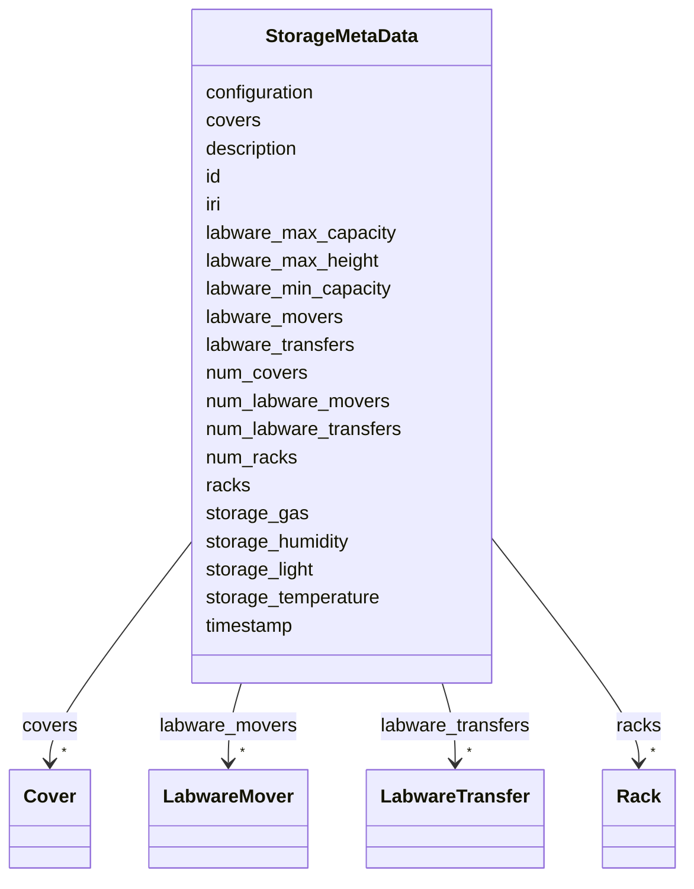

# Class: StorageMetaData


_"The Storage Metadata."_


URI: [oso:device/storageMetaData](http://w3id.org/oso/device/storageMetaData)





<!-- no inheritance hierarchy -->


## Slots

| Name | Cardinality and Range | Description | Inheritance |
| ---  | --- | --- | --- |
| [id](id.md) | 1 <br/> [String](String.md) | "The identifier of the resource | direct |
| [timestamp](timestamp.md) | 1 <br/> [Datetime](Datetime.md) | "The timestamp of the measurement | direct |
| [description](description.md) | 0..1 <br/> [String](String.md) | "A description of the calculation / measurement | direct |
| [iri](iri.md) | 0..1 <br/> [String](String.md) | "The International Resource Identifier (IRI) of the entity | direct |
| [labware_min_capacity](labware_min_capacity.md) | 0..1 <br/> [Integer](Integer.md) | labware capacity, min | direct |
| [labware_max_capacity](labware_max_capacity.md) | 0..1 <br/> [Integer](Integer.md) | labware capacity, max | direct |
| [labware_max_height](labware_max_height.md) | 0..1 <br/> [Float](Float.md) | max | direct |
| [storage_temperature](storage_temperature.md) | 0..1 <br/> [Float](Float.md) | "The storage temperature | direct |
| [storage_humidity](storage_humidity.md) | 0..1 <br/> [Float](Float.md) | "The storage humidity | direct |
| [storage_light](storage_light.md) | 0..1 <br/> [Float](Float.md) | "The storage light | direct |
| [storage_gas](storage_gas.md) | 0..1 <br/> [String](String.md) | "The storage gas | direct |
| [num_racks](num_racks.md) | 0..1 <br/> [Integer](Integer.md) | "The number of racks / stacks in the storage unit | direct |
| [racks](racks.md) | * <br/> [Rack](Rack.md) | "The racks in the storage unit | direct |
| [num_labware_movers](num_labware_movers.md) | 0..1 <br/> [Integer](Integer.md) | "The number of labware movers in the storage unit | direct |
| [labware_movers](labware_movers.md) | * <br/> [LabwareMover](LabwareMover.md) | "The labware movers | direct |
| [num_labware_transfers](num_labware_transfers.md) | 0..1 <br/> [Integer](Integer.md) | "The number of transfer stations in the storage unit | direct |
| [labware_transfers](labware_transfers.md) | * <br/> [LabwareTransfer](LabwareTransfer.md) | "The labware transfer stations | direct |
| [num_covers](num_covers.md) | 0..1 <br/> [Integer](Integer.md) | "The number of covers / doors in the storage unit | direct |
| [covers](covers.md) | * <br/> [Cover](Cover.md) | "The covers / doors | direct |
| [configuration](configuration.md) | 0..1 <br/> [String](String.md) | "Extra / additional configuration of the hardware, in JSON-LD format | direct |


## Identifier and Mapping Information


### Schema Source


* from schema: https://w3id.org/opensourcelab/storage_metadata_model


## Mappings

| Mapping Type | Mapped Value |
| ---  | ---  |
| self | oso:device/storageMetaData |
| native | oso:StorageMetaData |


## LinkML Source

<!-- TODO: investigate https://stackoverflow.com/questions/37606292/how-to-create-tabbed-code-blocks-in-mkdocs-or-sphinx -->

### Direct

<details>
```yaml
name: StorageMetaData
description: '"The Storage Metadata."'
from_schema: https://w3id.org/opensourcelab/storage_metadata_model
slots:
- id
- timestamp
- description
- iri
- labware_min_capacity
- labware_max_capacity
- labware_max_height
- storage_temperature
- storage_humidity
- storage_light
- storage_gas
- num_racks
- racks
- num_labware_movers
- labware_movers
- num_labware_transfers
- labware_transfers
- num_covers
- covers
- configuration
class_uri: oso:device/storageMetaData

```
</details>

### Induced

<details>
```yaml
name: StorageMetaData
description: '"The Storage Metadata."'
from_schema: https://w3id.org/opensourcelab/storage_metadata_model
attributes:
  id:
    name: id
    description: '"The identifier of the resource."'
    from_schema: https://w3id.org/opensourcelab/storage_metadata_model
    rank: 1000
    slot_uri: http://purl.org/dc/terms/identifier
    identifier: true
    alias: id
    owner: StorageMetaData
    domain_of:
    - StorageMetaData
    - LabwarePosition
    - LabwareTransfer
    - Cover
    - LabwareMover
    - Rack
    range: string
    required: true
  timestamp:
    name: timestamp
    description: '"The timestamp of the measurement."'
    from_schema: https://w3id.org/opensourcelab/storage_metadata_model
    rank: 1000
    slot_uri: http://purl.org/dc/terms/date
    alias: timestamp
    owner: StorageMetaData
    domain_of:
    - StorageMetaData
    - LabwarePosition
    - LabwareTransfer
    - Cover
    - LabwareMover
    - Rack
    range: datetime
    required: true
  description:
    name: description
    description: '"A description of the calculation / measurement."'
    from_schema: https://w3id.org/opensourcelab/storage_metadata_model
    rank: 1000
    slot_uri: http://purl.org/dc/terms/description
    alias: description
    owner: StorageMetaData
    domain_of:
    - StorageMetaData
    - LabwarePosition
    - LabwareTransfer
    - LabwareMover
    - Rack
    range: string
    required: false
  iri:
    name: iri
    description: '"The International Resource Identifier (IRI) of the entity."'
    from_schema: https://w3id.org/opensourcelab/storage_metadata_model
    rank: 1000
    slot_uri: oso:entity/IRI
    alias: iri
    owner: StorageMetaData
    domain_of:
    - StorageMetaData
    range: string
    required: false
  labware_min_capacity:
    name: labware_min_capacity
    description: labware capacity, min. number of labware, some centrifuges need at
      least 2 labware, e.g. for balancing
    from_schema: https://w3id.org/opensourcelab/storage_metadata_model
    rank: 1000
    slot_uri: oso:device/labware_min_capacity
    alias: labware_min_capacity
    owner: StorageMetaData
    domain_of:
    - StorageMetaData
    - Rack
    range: integer
    required: false
  labware_max_capacity:
    name: labware_max_capacity
    description: labware capacity, max. number of labware
    from_schema: https://w3id.org/opensourcelab/storage_metadata_model
    rank: 1000
    slot_uri: oso:device/labware_max_capacity
    alias: labware_max_capacity
    owner: StorageMetaData
    domain_of:
    - StorageMetaData
    - Rack
    range: integer
    required: false
  labware_max_height:
    name: labware_max_height
    description: max. labware height in m
    from_schema: https://w3id.org/opensourcelab/storage_metadata_model
    rank: 1000
    slot_uri: oso:device/labware_max_height
    alias: labware_max_height
    owner: StorageMetaData
    domain_of:
    - StorageMetaData
    - LabwarePosition
    - Rack
    range: float
    required: false
  storage_temperature:
    name: storage_temperature
    description: '"The storage temperature."'
    from_schema: https://w3id.org/opensourcelab/storage_metadata_model
    rank: 1000
    slot_uri: oso:device/storageTemperature
    alias: storage_temperature
    owner: StorageMetaData
    domain_of:
    - StorageMetaData
    range: float
    required: false
    unit:
      ucum_code: K
      has_quantity_kind: OM:Temperature
  storage_humidity:
    name: storage_humidity
    description: '"The storage humidity."'
    from_schema: https://w3id.org/opensourcelab/storage_metadata_model
    rank: 1000
    slot_uri: oso:device/storageHumidity
    alias: storage_humidity
    owner: StorageMetaData
    domain_of:
    - StorageMetaData
    range: float
    required: false
    unit:
      has_quantity_kind: OM:RelativeHumidity
  storage_light:
    name: storage_light
    description: '"The storage light."'
    from_schema: https://w3id.org/opensourcelab/storage_metadata_model
    rank: 1000
    slot_uri: oso:device/storageLight
    alias: storage_light
    owner: StorageMetaData
    domain_of:
    - StorageMetaData
    range: float
    required: false
    unit:
      ucum_code: lx
      has_quantity_kind: OM:LuminousIntensity
  storage_gas:
    name: storage_gas
    description: '"The storage gas."'
    from_schema: https://w3id.org/opensourcelab/storage_metadata_model
    rank: 1000
    slot_uri: oso:device/storageGas
    alias: storage_gas
    owner: StorageMetaData
    domain_of:
    - StorageMetaData
    range: string
    required: false
  num_racks:
    name: num_racks
    description: '"The number of racks / stacks in the storage unit."'
    from_schema: https://w3id.org/opensourcelab/storage_metadata_model
    rank: 1000
    slot_uri: oso:device/numRacks
    alias: num_racks
    owner: StorageMetaData
    domain_of:
    - StorageMetaData
    range: integer
    required: false
  racks:
    name: racks
    description: '"The racks in the storage unit."'
    from_schema: https://w3id.org/opensourcelab/storage_metadata_model
    rank: 1000
    slot_uri: oso:device/racks
    alias: racks
    owner: StorageMetaData
    domain_of:
    - StorageMetaData
    range: Rack
    required: false
    multivalued: true
  num_labware_movers:
    name: num_labware_movers
    description: '"The number of labware movers in the storage unit."'
    from_schema: https://w3id.org/opensourcelab/storage_metadata_model
    rank: 1000
    slot_uri: oso:device/numLabwareMovers
    alias: num_labware_movers
    owner: StorageMetaData
    domain_of:
    - StorageMetaData
    range: integer
    required: false
  labware_movers:
    name: labware_movers
    description: '"The labware movers."'
    from_schema: https://w3id.org/opensourcelab/storage_metadata_model
    rank: 1000
    slot_uri: oso:device/labwareMovers
    alias: labware_movers
    owner: StorageMetaData
    domain_of:
    - StorageMetaData
    range: LabwareMover
    required: false
    multivalued: true
  num_labware_transfers:
    name: num_labware_transfers
    description: '"The number of transfer stations in the storage unit."'
    from_schema: https://w3id.org/opensourcelab/storage_metadata_model
    rank: 1000
    slot_uri: oso:device/numTransferStations
    alias: num_labware_transfers
    owner: StorageMetaData
    domain_of:
    - StorageMetaData
    range: integer
    required: false
  labware_transfers:
    name: labware_transfers
    description: '"The labware transfer stations."'
    from_schema: https://w3id.org/opensourcelab/storage_metadata_model
    rank: 1000
    slot_uri: oso:device/labwareTransfers
    alias: labware_transfers
    owner: StorageMetaData
    domain_of:
    - StorageMetaData
    range: LabwareTransfer
    required: false
    multivalued: true
  num_covers:
    name: num_covers
    description: '"The number of covers / doors in the storage unit."'
    from_schema: https://w3id.org/opensourcelab/storage_metadata_model
    rank: 1000
    slot_uri: oso:device/numCovers
    alias: num_covers
    owner: StorageMetaData
    domain_of:
    - StorageMetaData
    range: integer
    required: false
  covers:
    name: covers
    description: '"The covers / doors."'
    from_schema: https://w3id.org/opensourcelab/storage_metadata_model
    rank: 1000
    slot_uri: oso:device/covers
    alias: covers
    owner: StorageMetaData
    domain_of:
    - StorageMetaData
    range: Cover
    required: false
    multivalued: true
  configuration:
    name: configuration
    description: '"Extra / additional configuration of the hardware, in JSON-LD format."'
    from_schema: https://w3id.org/opensourcelab/storage_metadata_model
    rank: 1000
    slot_uri: oso:device/configuration
    alias: configuration
    owner: StorageMetaData
    domain_of:
    - StorageMetaData
    - LabwarePosition
    - LabwareTransfer
    - Cover
    - LabwareMover
    - Rack
    range: string
    required: false
class_uri: oso:device/storageMetaData

```
</details>